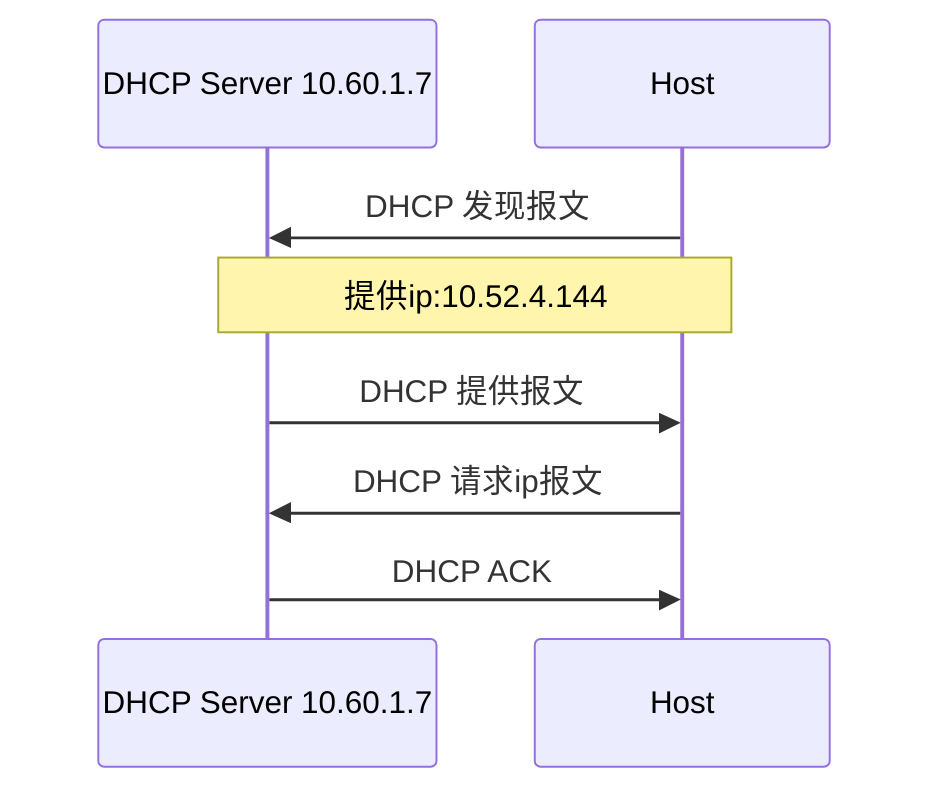

```mermaid
sequenceDiagram
    participant A as DHCP Server 10.60.1.7
    participant B as Host
    B->>A: DHCP 发现报文
    Note over A,B:  提供ip:10.52.4.144
    A->>B: DHCP 提供报文
    B->>A: DHCP 请求ip报文
    A->>B: DHCP ACK
```
